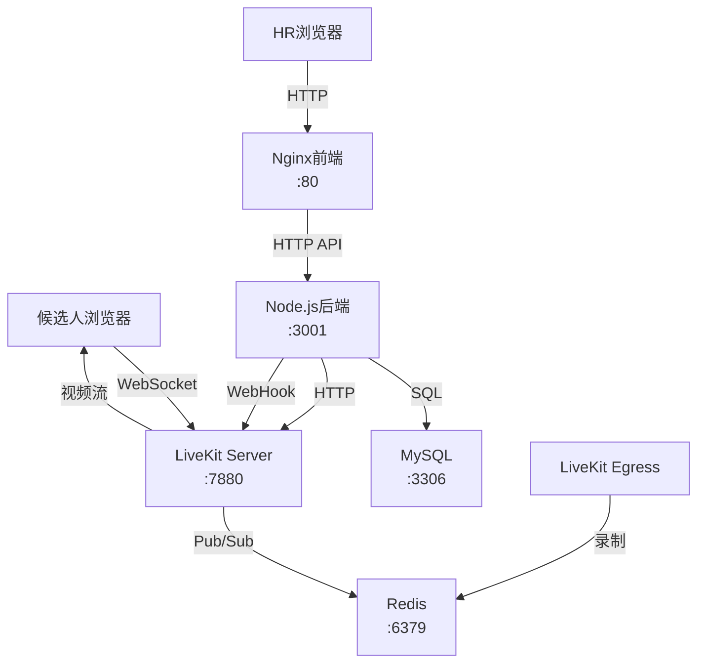
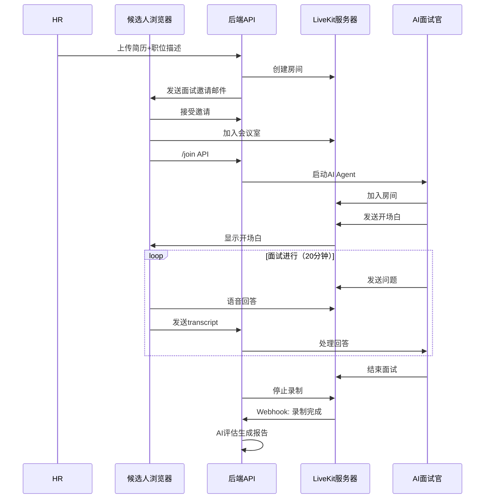

# AI面试助手 (AI Interview Assistant)

基于LiveKit的AI视频面试系统，支持自动面试邀请、AI面试官自动加入、实时视频面试、录制保存、会议纪要生成和智能评估。

**本项目内置LiveKit服务器**，所有模块（前端、后端、数据库、LiveKit、录制服务）均通过Docker Compose统一部署，一键启动。

## 功能特性

- **AI视频面试**：基于LiveKit的高清视频通话
- **自动面试邀请**：发送邮件包含面试链接（一周有效）
- **AI面试官**：自动加入会议室，进行开场交流和提问
- **20分钟定时**：面试自动限时20分钟
- **视频录制**：自动录制面试过程并保存
- **会议纪要**：自动整理面试对话为文字纪要
- **智能评估**：从回答流畅度、专业度、沟通能力等维度给出评分和评价

## 技术栈

- **前端**：React 18 + Ant Design 5 + LiveKit Client SDK
- **后端**：Node.js + Express + Sequelize + LiveKit Server SDK
- **数据库**：MySQL 8.0
- **消息队列**：Redis 7（LiveKit消息队列）
- **视频服务**：LiveKit（内置部署）
- **录制服务**：LiveKit Egress
- **AI模型**：通义千问(Qwen)

## 系统架构



### Docker服务列表

| 服务 | 容器名 | 端口 | 说明 |
|------|--------|------|------|
| mysql | interview-mysql | 3306 | 数据库 |
| redis | interview-redis | 6379 | LiveKit消息队列 |
| livekit | interview-livekit | 7880/7881/7882 | 视频通话服务器 |
| egress | interview-egress | 8080 | 录制服务 |
| backend | interview-backend | 3001 | 后端API |
| frontend | interview-frontend | 80 | Nginx前端 |

## 快速开始

### 1. 前置要求

- Docker Engine >= 20.10
- Docker Compose >= 2.0
- 至少 4GB 可用内存
- 端口 80/3001/3306/6379/7880-7882/8080 未被占用

### 2. 环境变量配置

```bash
# 复制环境变量模板
cp .env.example .env

# 编辑 .env 文件（按需修改）
# 默认配置已可直接使用，只需修改 QWEN_API_KEY 和邮件配置
```

`.env` 默认配置：

```env
# 数据库
DB_PASSWORD=root123456

# LiveKit（内置，一般不需要改）
LIVEKIT_API_KEY=livekit_api_key
LIVEKIT_API_SECRET=livekit_api_secret_change_me
LIVEKIT_PUBLIC_WS_URL=ws://localhost:7880

# AI和邮件（必须配置）
QWEN_API_KEY=your_qwen_api_key
EMAIL_HOST=smtp.163.com
EMAIL_USER=your_email@163.com
EMAIL_PASSWORD=your_email_password
```

### 3. 一键启动所有服务

```bash
# 启动所有服务（前台运行，方便查看日志）
docker-compose up

# 或在后台运行
docker-compose up -d

# 查看各服务日志
docker-compose logs -f backend
docker-compose logs -f livekit
```

### 4. 访问系统

| 服务 | 地址 |
|------|------|
| 前端页面 | http://localhost |
| 后端API | http://localhost:3001/api/health |
| LiveKit调试 | http://localhost:7880 |

### 5. 停止服务

```bash
# 停止所有服务
docker-compose down

# 停止并删除数据卷（清空数据库和上传文件）
docker-compose down -v
```

## 面试流程



## 数据库表结构

### interviews表关键字段

| 字段 | 说明 |
|------|------|
| meeting_url | LiveKit面试房间URL |
| meeting_id | LiveKit房间名称 |
| meeting_token | 候选人访问令牌（7天有效） |
| meeting_token_expires | 令牌过期时间 |
| recording_url | 面试录制文件URL |
| recording_egress_id | LiveKit录制任务ID |
| transcript | 面试对话文字记录 |
| meeting_minutes | AI生成的会议纪要 |
| ai_evaluation | AI评估结果（JSON格式） |
| overall_score | 综合评分 |
| ai_agent_joined | AI面试官是否加入 |
| interview_started_at | 面试开始时间 |
| interview_ended_at | 面试结束时间 |

## API接口

### 面试管理

- `POST /api/interview/create` - 创建面试（自动生成LiveKit会议室）
- `POST /api/interview/:id/schedule` - 手动安排面试
- `POST /api/interview/:id/join` - 候选人加入面试（触发AI面试官自动加入）
- `POST /api/interview/:id/transcript` - 接收前端语音识别文本
- `POST /api/interview/:id/end` - 结束面试
- `POST /api/interview/:id/evaluate` - 手动触发AI评估
- `POST /api/interview/:id/refresh-token` - 刷新面试令牌

### LiveKit Webhook

- `POST /api/livekit/webhook` - 接收录制完成通知

## 注意事项

1. **浏览器兼容性**：建议使用Chrome或Edge浏览器进行视频面试
2. **麦克风权限**：首次使用需要允许浏览器访问麦克风
3. **网络要求**：需要稳定的网络连接，建议使用有线网络
4. **令牌有效期**：面试链接默认7天有效，过期可刷新
5. **NAT穿透**：如果在内网部署，可能需要配置TURN服务器进行NAT穿透

## 常见问题

### Q: LiveKit无法连接？
检查防火墙是否开放了UDP端口7882：
```bash
# Linux
sudo ufw allow 7880:7882/tcp
sudo ufw allow 7882/udp
```

### Q: 录制文件在哪里？
录制文件保存在Docker卷 `recordings_data` 中：
```bash
# 查看录制文件
docker volume ls | grep recordings
```

### Q: 如何修改LiveKit API密钥？
编辑 `.env` 文件后重启：
```bash
docker-compose down
docker-compose up -d
```

## License

MIT